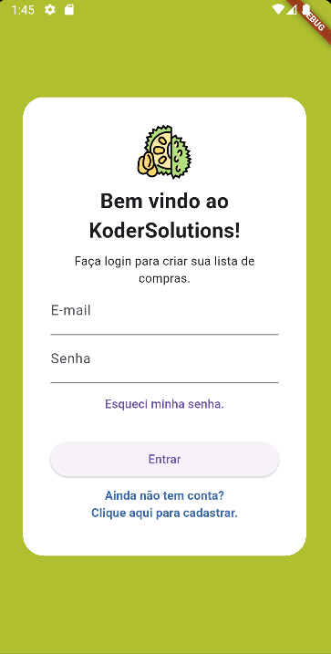
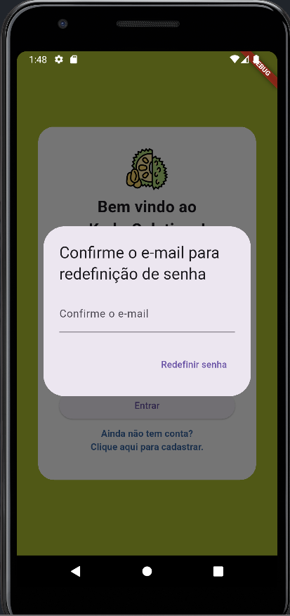
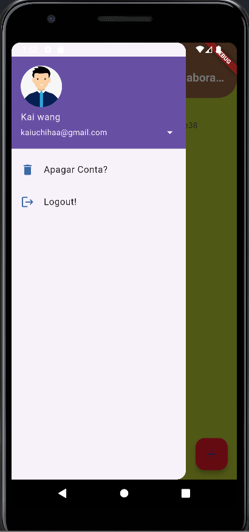
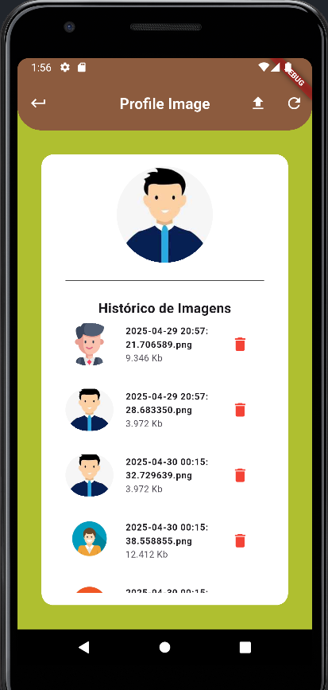
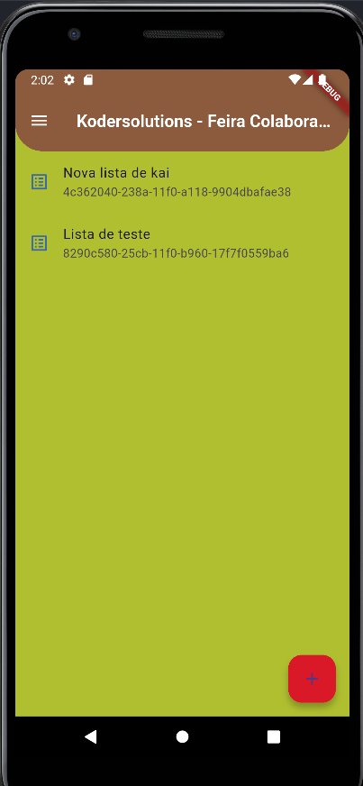
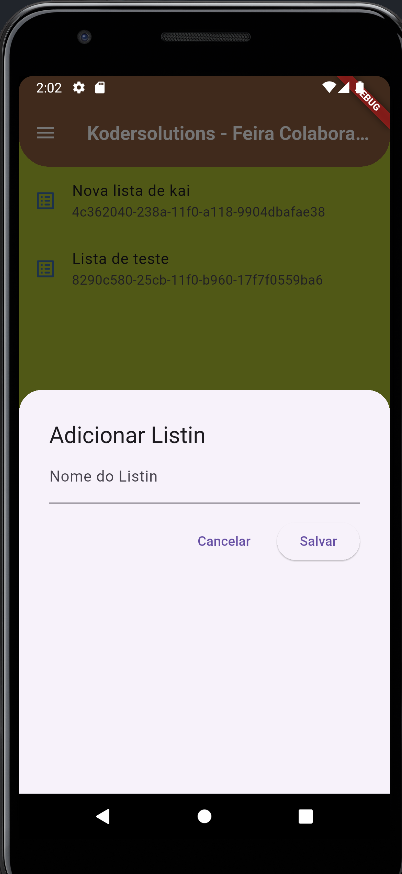
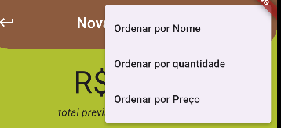
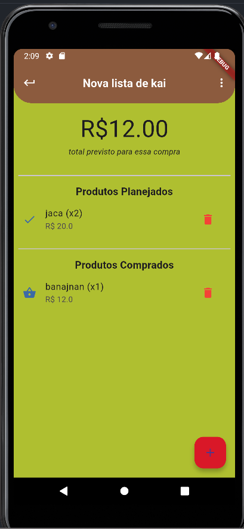
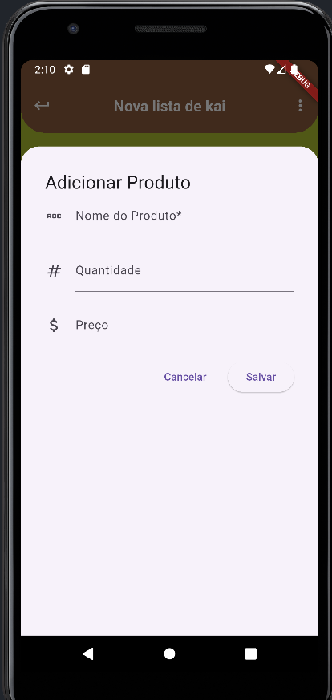

# firebase_with_flutter

Essa aplicacão tem como objetivo explocar diversas possibilidades de uso do Firebase, Nesse projeto usamos:

- **Banco de dados** : Banco de dados __noSQL__ do firebase para se conectar e enviar arquivos, além de coletar arquivo com conexão Async, além disso usei Streams para veririfar mudançaas com o banco de dados do firebase em tempo real.

- **Firebase Auth** : Autenticação do firebase simples com login e senha, validação de existencia de conta e criação de outras contas, além de configurar e-mail de esqueci password. Configurado e conectado o banco de dados noSql para que somente os usuários logados possam acessas suas informações.

- **Firebase Store** : Usado o Firebase Store para conectar a API e gravar arquivos como a foto de perfil do usuário, além de configurar regras de negócio onde somente o usuários logados poderão acessar suas respectivas pasta, impedindo assim o acesso publico ao Store de arquivos.

# TELAS
___

## LOGIN / RESET PASSWORD / CREATE ACCOUNT

Ao iniciar a aplicação o usuário terá a visão da tela de login com as sequintes funções:

- **LOGIN**: Caso já tenha conta, poderá realizar o login com senha e e-mail, caso ocorra um error será noticado que conta é inválida.
- **CRIAR CONTA**: Criar um novo usuário, caso não tenha conta poderá criar um novo usuário com e-mail e senha.
- **RESET DE SENHA**: Atribuída a responsábilidade para o usuário resetar sua senha caso tenha perdido, ao preencher o formulário de reset de senha receberá um e-mail com link para executar o reset manual de seu password.

## Tela de Login

## Tela de Reset Password

## Tela de Create Account

---

# DRAWER ACCOUNT

Ao logar no app no canto superior direito o usuário terá acesso aa botão de hamburger onde poderá clicar e terá acesso a algumas funcionabilidades.

- **Trocar fotos**: Usuário poderá fazer manipulações da fotos ao clicar no icone de seta azul.
- **remover Conta**: Usuário poderá remover sua conta ao clicar nesse botão.
- **Logout**: Usuário poderá se delogar da aplicação se clicar nesse botão.

# TROCAR FOTOS

O sistema permite que o usuário troque sua foto de login, acessando diretamente o Firebase store e executando métodos async para coletar a foto e mostar para o usuário a foto é salva no perfil do usuario com o firebase auth.

Na página abaixo ao clicar no drawer o usuário tem a opção de clicar na seta branca de pois ir para páagina de trocar fotos onde pode:

- **Adicionar novas fotos**: ( no botão de upload no canto superio direito no appBar)
- **Atualizar lista de fotos**: caso ocorra algum problema no carregamento de imagens, (No botão de reload no canto superior direito no appBar)
- **Remover Fotos**:  o usuário poderá remover fotos existentes do storage clicando no icone de lixeira.
- **Substitiur foto de perfil**: O usuário poderá fazer a substituição da foto de perfil, basta clicar em qualquer foto do histórico de imagens.

# LISTA DE COMPRAS

Essa é a tela principal da aplicação, o usuário poderá criar listas de compras, para criar uma nova lista basta clicar no botão flutuante no canto inferior direito e preencher os dados do nome da lista, o usuário poderá clicar no nome da lista para ir para página de produtos da lista.

 

# LISTA DE PRODUTOS

Essa lita é composta de 2 componentee o cabeçalho e o corpo.

## Cabeçalho

Aqui o usuário tem as seguintes funcionabilidades.

- **Botão voltar**: No canto superior esquerdo o usuário terá o botão de voltar para retornar a tela de listas de compras.
- **Organizar**: No canto superior direito há tres pontos onde ao clicar o usuário poderá organizar as lista por nome, quantidade e preço, por padrão a organização e Crescente porém ao clicar mais uma vez a ordem mudará para decrescente.

## Corpo

No corpo o usuário terá acesso a lista de compra, que será dividida em planejados e comprados. Para ambas a lista o usuário terá o botão de remover, caso click nesse botão irá remover o item do banco de dados.

- ** planejados **: essa lista não soma o total da compra acima somente adiciona ao cliacar em um produto planejado o esse vai automáticamente para produtos comprados. 
- ** Comprados **: Os produtos comprados somam o total acima da lista, multiplicando por suas quantidades. ao clicar em um produto comprado ele pode voltar para a lista de planejados se assim desejar.

Além desses itens a página de produto, contém o botão no canto inferior da tela onde o usuário ao clicar será direcionado para o formulário de preenchimento de um novo produto.

Esse é um projeto didático apra apreender o uso único da ferramentas Flutter com conexão com o firebase, da formação do curso alura com firebase que desenvolvi ao decorrer dessa formação.
